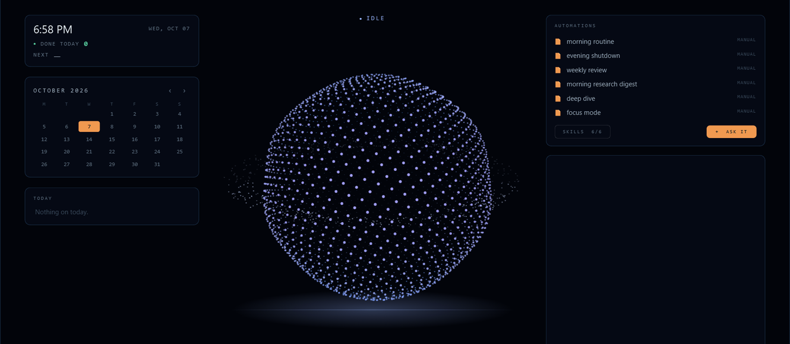
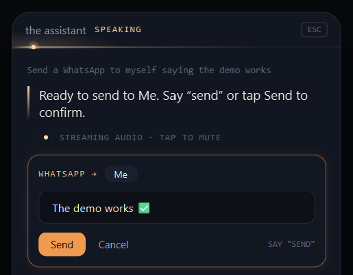
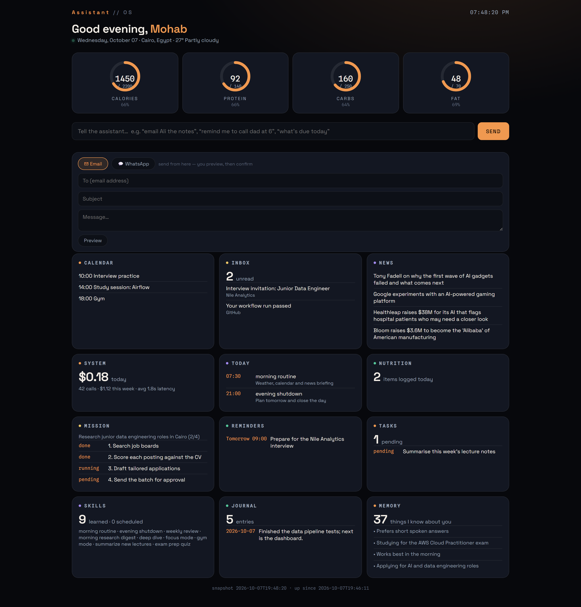
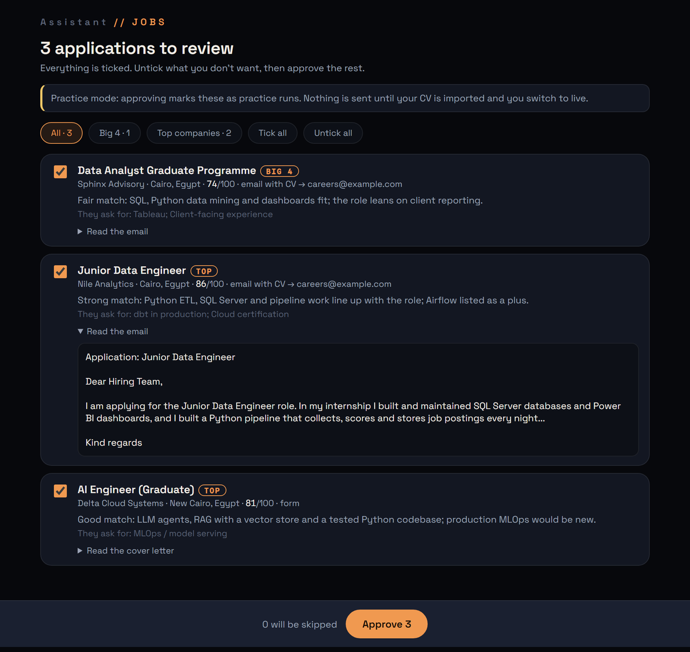
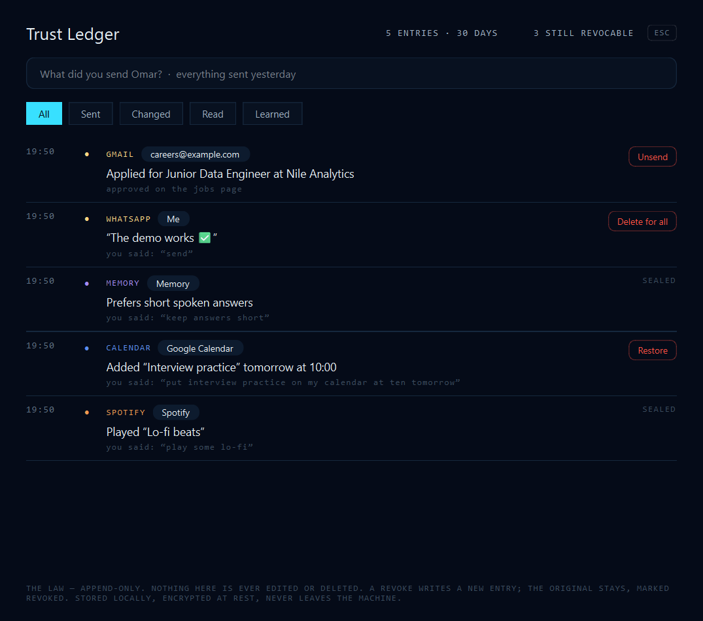
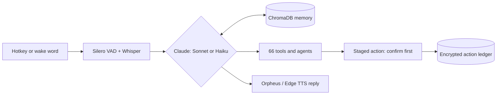

# Voice AI Assistant for Windows

[](https://github.com/mooo-9/voice-ai-assistant/actions/workflows/tests.yml)

A personal voice assistant for Windows 11 that runs the PC for you. You call it with a custom wake phrase or a hotkey, speak naturally, and it plans the task, uses its tools and answers out loud.

It is built in Python on the Claude API. It has 66 tools, long-term vector memory, its own speech pipeline, and an automated job-search pipeline. **2,400+ pytest tests** gate every change.



---

## What it can do

- **Messages and email:** reads and sends Gmail, WhatsApp and Telegram messages.
- **Music and media:** plays and controls Spotify and YouTube.
- **Files and apps:** finds, opens, moves and converts files and PDFs; launches apps; runs PowerShell.
- **Planning:** Google Calendar, reminders, Todoist, Notion and Obsidian notes.
- **Screen control:** reads the screen with vision and uses the mouse and keyboard to drive apps.
- **Research:** web search, Wikipedia, news and a research agent that writes up findings.
- **Job search:** finds postings, scores each one against the CV, writes a tailored CV and cover letter, and applies only after one-click approval.

## A look inside

*Screenshots use sample data.*

**Confirm before it sends.** Every outgoing message is staged first, showing who it goes to and what it says. It sends only when you say "send" or tap Send.



**Dashboard.** Calendar, inbox, news, a running multi-step mission, reminders, memory, and today's API cost and latency, all in one page served by the app.



**Job-search review.** Each posting gets a fit score out of 100, a reason, the skills it asks for that the CV lacks, and a tailored email or cover letter. Nothing is sent until the batch is approved.



**Trust ledger.** Every action is recorded with the words that caused it. While the service still allows it, an action can be undone (unsend, delete for everyone, restore). The record is append-only and encrypted.



---

## How it works



| Layer | What it uses |
|---|---|
| **Reasoning** | Claude API with tool calling. Each request goes to Sonnet or the faster Haiku depending on how complex it is, and a local Ollama model takes over if the API is unreachable. A router hands specialist work to agents: browser, files, screen, research, health and jobs. |
| **Memory** | Sentence-transformer embeddings (`all-MiniLM-L6-v2`) in a ChromaDB vector store, recalled on every turn. |
| **Speech in** | A custom wake-word model, trained with logistic regression on openWakeWord features and exported to ONNX (`scripts/train_hey_fager.py`). Silero VAD detects the end of speech, then Whisper transcribes: Groq's cloud Whisper first, with local faster-whisper as fallback. |
| **Speech out** | Groq Orpheus neural TTS, with Edge TTS as fallback. You can talk over it to interrupt (barge-in). |
| **Trust and safety** | Every action taken on your behalf is written to an append-only ledger, encrypted at rest with Fernet. Nothing is ever edited or deleted, and an undo is a new entry. API keys live in an encrypted vault. |
| **Interface** | PyQt6 overlay and command center, plus a local HTTP/JSON dashboard. |

### Job-search pipeline

```
find  →  score  →  tailor  →  approve  →  apply  →  track replies
```

Every night it collects postings from the job boards (LinkedIn, Wuzzuf) and from company career sites. It scores each posting against the CV with an LLM and drafts a tailored application for the strong matches. In the morning the batch waits on the dashboard's `/jobs` page, and nothing is sent until it is approved. A practice mode records what *would* have been sent without anything leaving the machine.

---

## Project structure

```
core/
  brain.py        Claude API, model routing, tool dispatch
  agents/         router plus browser, file, screen, research, health and job agents
  career/         job-search pipeline: sources, scorer, tailor, appliers, tracker
  voice_in.py     wake word, voice activity detection, Whisper speech-to-text
  voice_out.py    neural TTS with fallback
  barge_in.py     interrupt the assistant mid-sentence
  memory.py       ChromaDB vector memory
  ledger.py       encrypted, append-only action ledger
  dashboard.py    local HTTP/JSON dashboard
tools/            66 tools (email, WhatsApp, Spotify, calendar, files, screen, ...)
ui/               PyQt6 overlay, command center and cockpit
tests/            pytest suite
scripts/          wake-word training and maintenance scripts
main.py           entry point
```

---

## Setup

**Requirements:** Windows 11, Python 3.14+, an Anthropic API key. A Groq API key is optional and gives faster speech.

1. Clone the repo and install dependencies. Install PyTorch CPU-only first to avoid a 2 GB CUDA download:

   ```powershell
   git clone https://github.com/mooo-9/voice-ai-assistant.git
   cd voice-ai-assistant
   python -m pip install torch --index-url https://download.pytorch.org/whl/cpu
   python -m pip install -r requirements.txt
   ```

   The project uses `pygame-ce`, because `pygame` has no wheel for Python 3.14.

2. Create a `.env` file with your keys:

   ```
   ANTHROPIC_API_KEY=sk-ant-...
   GROQ_API_KEY=...        # optional
   ```

3. Run it:

   ```powershell
   python main.py
   ```

   It starts in the system tray. On first launch it downloads Whisper `large-v3-turbo` (about 1.6 GB, skipped when `GROQ_API_KEY` is set) and the embedding model (about 90 MB).

4. Run the tests:

   ```powershell
   python -m pytest tests
   ```

### Using it

| Action | Result |
|---|---|
| Wake phrase, `Ctrl+Space` or `Ctrl+F12` | Opens the overlay and starts listening |
| `Ctrl+Shift+Space` | Opens the command center |
| Stop speaking | It detects the silence and starts working |
| `Escape` | Closes the overlay and cancels recording |
| Type in the text box | Works instead of speaking |

### Google Calendar (optional)

Create an OAuth 2.0 **Desktop app** client in the [Google Cloud Console](https://console.cloud.google.com) with the Calendar API enabled. Save the JSON as `data/credentials.json`, then ask "what do I have today?" and authorize in the browser. `credentials.json` and `token.json` are gitignored.

---

## Troubleshooting

- **The hotkey doesn't work:** run `python main.py` as Administrator. Some security software blocks global keyboard hooks.
- **"Nothing heard":** check that the default microphone is set in Windows Sound Settings.
- **No voice output:** Edge TTS needs an internet connection. Also check the audio output device.
- **Memory error on startup:** this is non-fatal. Reinstall with `pip install sentence-transformers --force-reinstall`.
